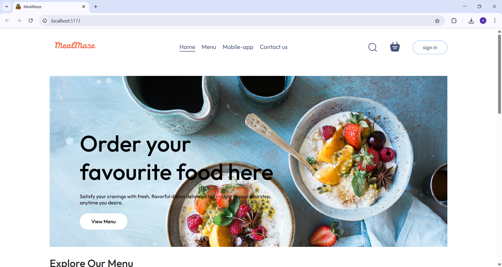
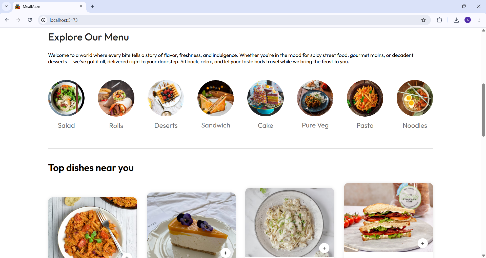
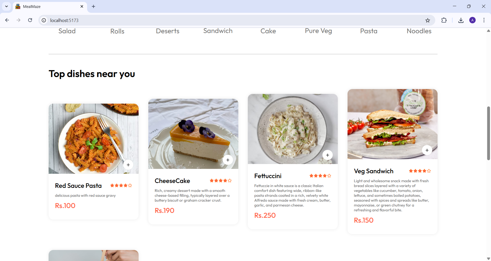
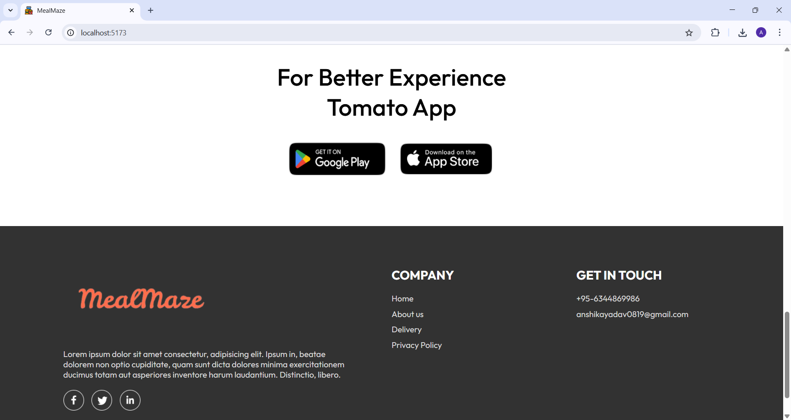
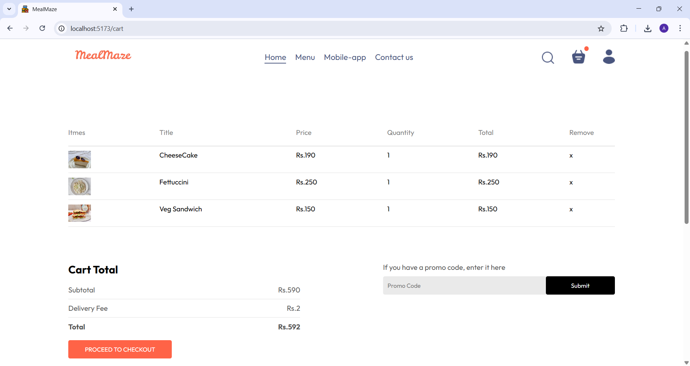
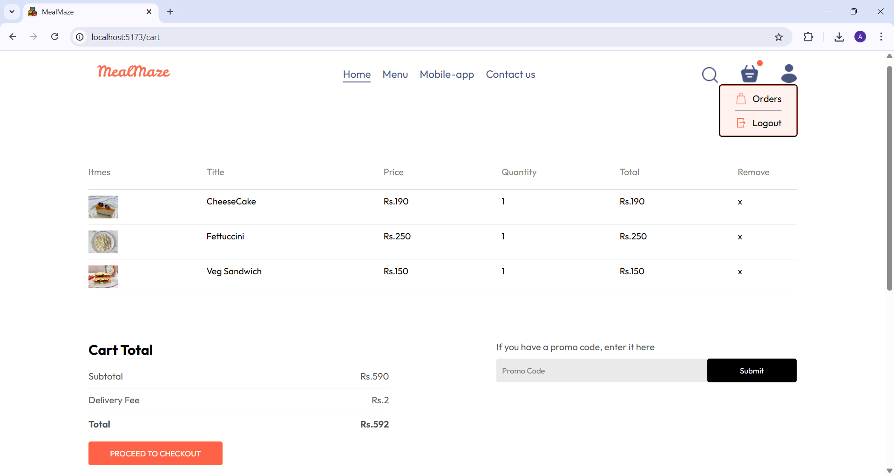
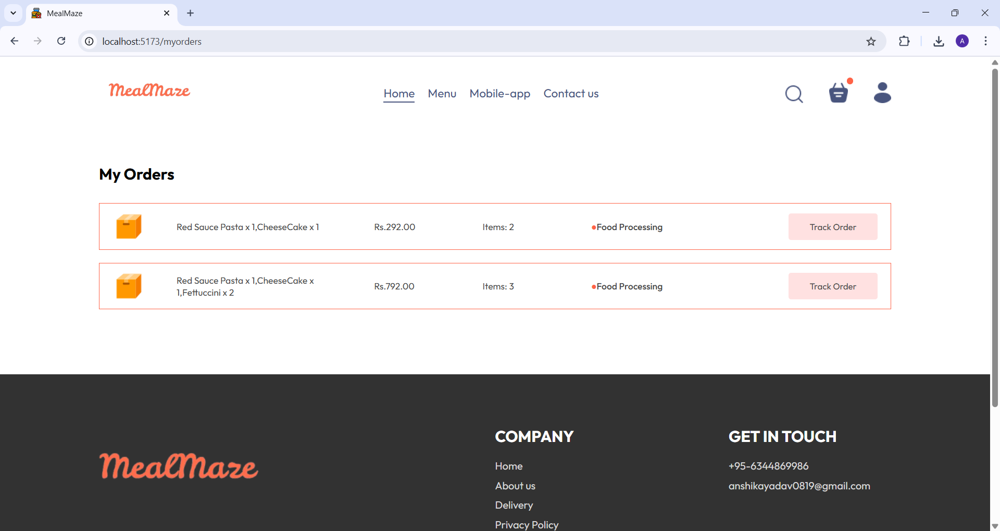
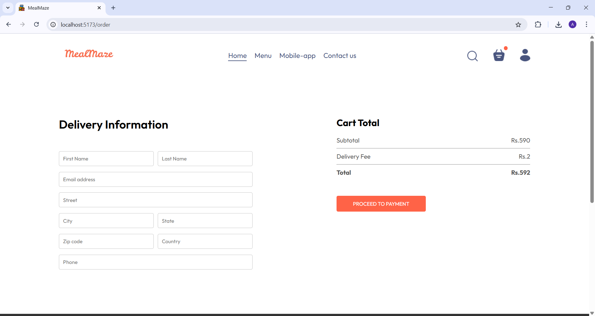

# 🍔 Food Delivery App

A modern and responsive MERN stack (MongoDB, Express, React, Node.js) web application that lets users explore menus, add items to cart, place orders, and manage accounts — all in a smooth, user-friendly interface.

## 🚀 Features

- 🔐 User Authentication (Sign in/Sign up with JWT)
- 🍽️ Browse and explore a variety of food items
- 🛒 Add to Cart and Dynamic Cart Total
- 🧾 Order Tracking & Order History
- 📱 Fully Responsive UI (Mobile & Desktop)
- 📂 Modular & Clean Codebase

## 📸 Screenshots











## 🛠️ Tech Stack

### Frontend
- React.js
- CSS3
- React Router DOM
- Axios

### Backend
- Node.js
- Express.js
- MongoDB
- Mongoose
- JSON Web Token (JWT)

## 🔧 Installation & Setup

Follow these steps to run the project locally:

### 1. Clone the repository
```bash
git clone https://github.com/ANSHIKA-YDV/food-delivery-app.git
cd food-delivery-app
```

### 2. Install frontend dependencies
```bash
cd client
npm install
```

### 3. Install backend dependencies
```bash
cd ../server
npm install
```

### 4. Create a `.env` file in the `/server` directory
```env
PORT=5000
MONGODB_URI=your_mongodb_connection_string
JWT_SECRET=your_jwt_secret_key
```

### 5. Start the application

**Backend**
```bash
cd server
npm start
```

**Frontend (in a new terminal)**
```bash
cd client
npm start
```

The app should now be running at `http://localhost:3000`

## 🧪 Test User Credentials (if any)

```txt
Email: test@example.com
Password: 123456
```

## 📁 Folder Structure

```
food-delivery-app/
├── client/             # React frontend
├── server/             # Node/Express backend
├── assets/             # Shared images and icons
└── README.md
```

## 🙏 Credits

This project was originally based on the YouTube tutorial by   
👩‍💻 [Anshika Yadav](https://github.com/ANSHIKA-YDV)

